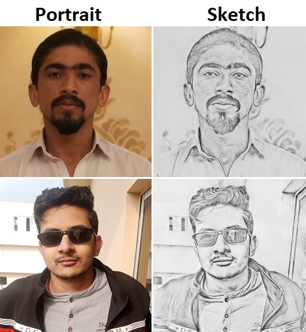

# pix2pix++: Portrait to Pencil Sketch Conversion

<p align="center">
  
</p>

A PyTorch implementation of **pix2pix++**, a GAN-based framework for converting portrait images into realistic pencil sketches. This project enhances the original pix2pix architecture by integrating a U-Net++ generator to capture richer contextual information and produce fine-grained sketch details.

## Table of Contents
- [Overview](#overview)
- [Installation and Setup](#InstallationandSetup)
- [Training](#training)
- [Inference](#inference)
- [Contributing](#Contributing)

## 🖋️ Overview

This repository contains:

- An improved **pix2pix++** model architecture for image-to-image translation.
- A dataset of portrait/sketch pairs created using a mobile app and preprocessed for training.
- Training and evaluation scripts to replicate and extend our results.

This work was part of a research study aiming to generate pencil sketches that preserve the artistic quality and structure of input portraits.

## Installation and Setup
1. Clone the repository:

   ```bash
   git clone https://github.com/Humzafazal72/pix2pixpp-portrait-to-pencil-sketch-conversion.git
   
2. Download Dependencies:
   ```bash
   pip install -r requirements.txt

## Training
train.py can be used to for training on either a paired dataset. Ensure that the dataset is in the same format as data/mock data.
``` bash
python train.py -s data/mock data/portrait -t data/mock data/sketches --gen_type unet++/unet -e 500

## Inference
train.py can be used to for training on either a paired dataset. Ensure that the dataset is in the same format as data/mock data.
``` bash
python train.py --gen_type unet++/unet --gen_weights_path path/to/weights.pth --img_path path/to/img

## Contributing
<a href="https://github.com/harrisrais"> Haris Raees </a>
<a href="https://github.com/Usman-tsk"> M. Usman </a>


